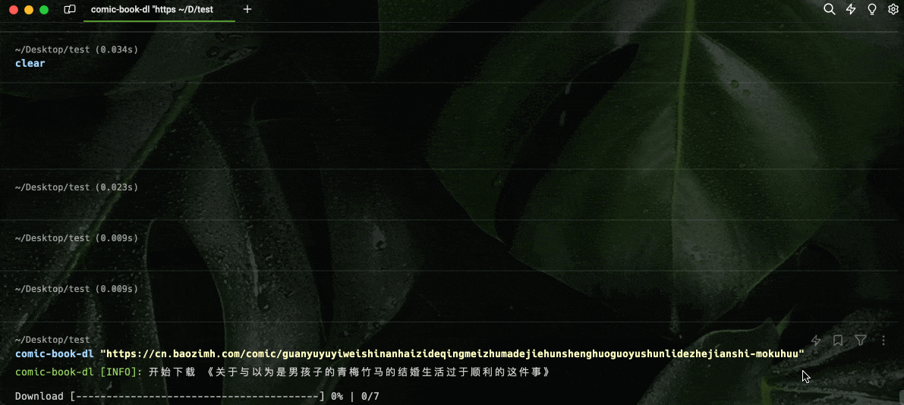
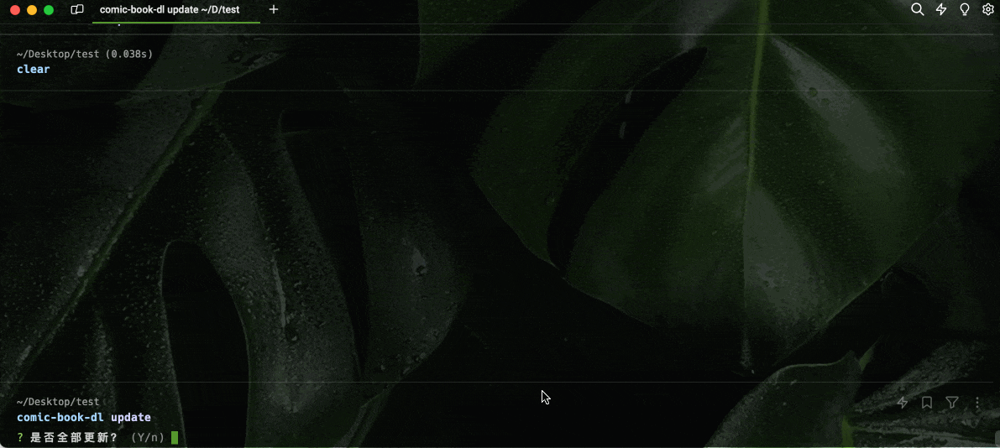

# comic-book-dl


<!-- markdownlint-disable MD033 -->

<p align="center">
  <b>一款漫画下载器</b><br/>
  <b>开源 | 高效 | 易用</b><br/><br/>
  
  
  
  <br>
</p>

## 安装

```bash
npm i -g comic-book-dl
```

## 用法

```bash
$ comic-book-dl --help

  Usage:
    $ comic-book-dl <url>

  Commands:
    update  更新已下载的漫画
    <url>   漫画目录页url

  For more info, run any command with the `--help` flag:
    $ comic-book-dl update --help
    $ comic-book-dl --help

  Options:
    -d, --distPath <dir>  下载的目录 eg: -d comic-book (default: comic-book)
    -h, --help            Display this message
    -v, --version         Display version number
```

### Start

开始新下载一部漫画到本地，会在当前目录创建 comic-book目录存放漫画的图片

> PS: 目前仅支持包子漫画, 后续尝试其他站点

```bash
# url 为对应想下载漫画目录
comic-book-dl "https://cn.baozimh.com/comic/mengoushia-feiniaocheng"
```



下载仅是下载漫画的图片，安装 [`comic-book-browser`](https://github.com/gxr404/comic-book-browser) 开始沉浸式的阅读体验

### 更新

如果漫画后续有更新,可使用 `update` 命令更新

```bash
comic-book-dl update
```



## 功能与建议

- [x] 支持下载中断继续
- [x] 支持漫画更新
- [ ] 更多站点支持🤔

目前项目处于开发初期, 如果你对该项目有任何功能与建议，欢迎在 Issues 中提出
